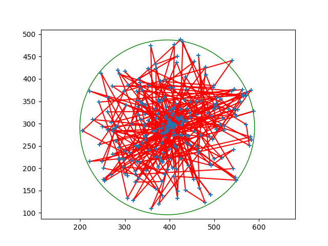

# SlipHull

Subject: <https://www-apr.lip6.fr/~buixuan/files/algav2019/projet_indiv2.pdf>

| Algorithm                    | Hull                                                            |
|------------------------------|-----------------------------------------------------------------|
| Minimal circle approximation |  |
| Minimal circle Ritter        |         |

## Getting started

### Activate environment

    source activate.sh

### Run

    src/main.py

### Exemple VSCode launch conf

```jsonc
// .vscode/launch.json

{
	// Use IntelliSense to learn about possible attributes.
	// Hover to view descriptions of existing attributes.
	// For more information, visit: https://go.microsoft.com/fwlink/?linkid=830387
	"version": "0.2.0",
	"configurations": [
		{
			"name": "Python: Main",
			"type": "python",
			"request": "launch",
			"program": "${workspaceFolder}/src/main.py",
			"console": "internalConsole"
		}
	]
}
```

### Deactivate environment

    source deactivate.sh
